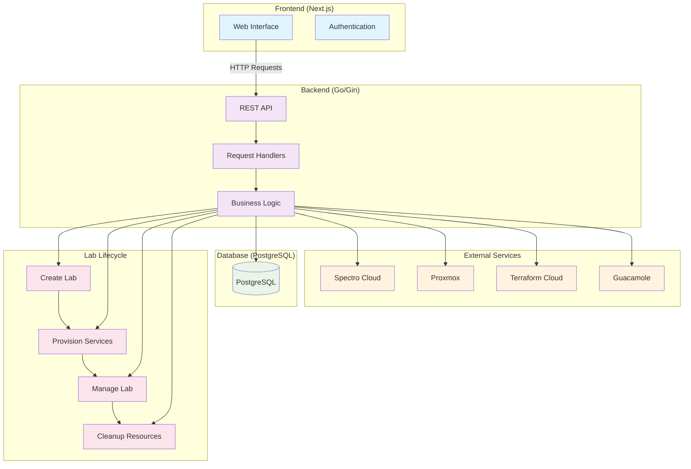

# Spectro Lab Architecture Diagram (Simplified)

## Simplified Architecture Overview

### **Frontend (Next.js)**
- **Web Interface**: React-based UI for lab management
- **Authentication**: User login and session management

### **Backend (Go/Gin)**
- **REST API**: HTTP endpoints for all operations
- **Request Handlers**: Process incoming requests
- **Business Logic**: Core application logic and orchestration

### **External Services**
- **Spectro Cloud**: Cloud platform management
- **Proxmox**: Infrastructure virtualization
- **Terraform Cloud**: Infrastructure as code
- **Guacamole**: Remote desktop access

### **Database (PostgreSQL)**
- Stores users, labs, credentials, and configurations

### **Lab Lifecycle**
1. **Create Lab**: User creates a new lab session
2. **Provision Services**: System sets up external services
3. **Manage Lab**: User works with the lab environment
4. **Cleanup Resources**: System cleans up when lab expires

## Key Features

- **Template-based Labs**: Predefined lab configurations
- **Multi-service Integration**: Automatically provisions multiple external services
- **Real-time Progress**: Live updates during lab setup
- **Automatic Cleanup**: Resources are cleaned up when labs expire
- **User Management**: Authentication and organization support
- **Admin Controls**: Administrative interface for system management
