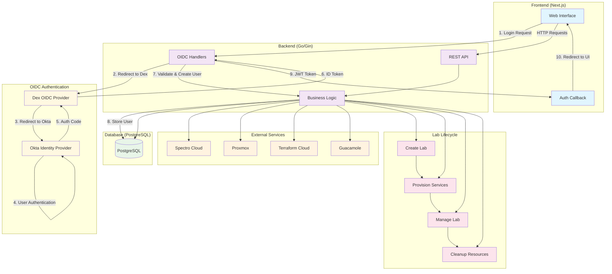

# Spectro Lab Architecture Diagram (Simplified)

## Simplified Architecture Overview

### **Frontend (Next.js)**
- **Web Interface**: React-based UI for lab management
- **Auth Callback**: Handles OIDC authentication callback from Dex

### **Backend (Go/Gin)**
- **REST API**: HTTP endpoints for all operations
- **OIDC Handlers**: Process OIDC authentication flows
- **Business Logic**: Core application logic and orchestration

### **OIDC Authentication**
- **Dex OIDC Provider**: Identity broker that handles OIDC flows
- **Okta Identity Provider**: External identity provider for user authentication

### **External Services**
- **Spectro Cloud**: Cloud platform management
- **Proxmox**: Infrastructure virtualization
- **Terraform Cloud**: Infrastructure as code
- **Guacamole**: Remote desktop access

### **Database (PostgreSQL)**
- Stores users, labs, credentials, and configurations

### **Lab Lifecycle**
1. **Create Lab**: User creates a new lab session
2. **Provision Services**: System sets up external services
3. **Manage Lab**: User works with the lab environment
4. **Cleanup Resources**: System cleans up when lab expires

### **Authentication Flow**
1. User initiates login from web interface
2. Backend redirects to Dex OIDC provider
3. Dex redirects to Okta for user authentication
4. User authenticates with Okta
5. Okta returns authorization code to Dex
6. Dex exchanges code for ID token and returns to backend
7. Backend validates token and creates/updates user in database
8. Backend generates JWT token for application session
9. Frontend receives token and redirects user to main interface

## Key Features

- **OIDC Authentication**: Secure authentication via Dex and Okta with group-based authorization
- **Template-based Labs**: Predefined lab configurations
- **Multi-service Integration**: Automatically provisions multiple external services
- **Real-time Progress**: Live updates during lab setup
- **Automatic Cleanup**: Resources are cleaned up when labs expire
- **User Management**: Organization-based user management with group mapping
- **Admin Controls**: Administrative interface for system management
